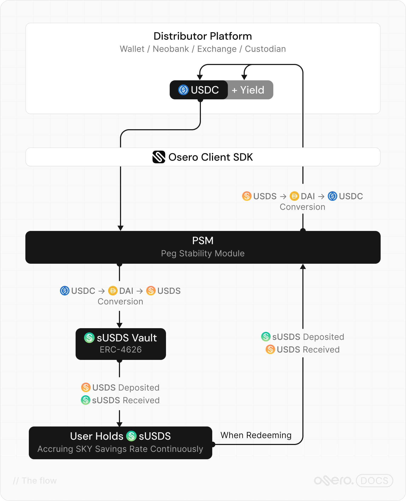

# Flow of Funds

Osero Earn connects stablecoin distributors to the Sky Savings Rate through a straightforward flow. Understanding this flow helps clarify what Osero Earn handles on your behalf and what your users experience end-to-end.

## The flow

<figure><figcaption></figcaption></figure>

## Step by step



### User deposits USDC

The user's platform — whether a neobank, wallet, or exchange — holds USDC on behalf of the user. The distributor uses the `@osero/client` SDK to initiate the savings flow.



### SDK builds the transaction plan

The SDK reads the live fee parameters from the relevant PSM contract, determines the optimal routing for the target chain, and assembles an `ExecutionPlan` — a wallet-agnostic description of the transactions required. No DeFi knowledge is needed from the integrating developer.

On **L2 chains** (Base, Arbitrum One, OP Mainnet, Unichain), this is a simple two-step flow: one approval transaction and one PSM3 swap that delivers sUSDS directly.

On **Ethereum Mainnet**, the flow is a two-phase `MultiStepExecution`: USDC is first converted to USDS via Sky's `UsdsPsmWrapper`, then USDS is deposited into the ERC-4626 sUSDS vault.



### Transactions are broadcast

The SDK's wallet adapter (`sendWith`) broadcasts each transaction in the correct order, waiting for onchain confirmation between steps where required.



### User holds sUSDS

Once the transactions settle, the user holds sUSDS — a yield-bearing token that accrues the Sky Savings Rate continuously and automatically. No further actions are required to earn yield.



### Redemption

When a user wants to exit, the same SDK handles the reverse flow: sUSDS is redeemed through the PSM back to USDC, with the user receiving their original principal plus accrued yield.



## What Osero Earn handles for you

| Complexity                                      | Handled by Osero Earn |
| ----------------------------------------------- | --------------------- |
| Chain-specific contract routing                 | ✅                     |
| PSM fee reads (tin / tout)                      | ✅                     |
| ERC-20 approval management                      | ✅                     |
| ERC-4626 vault deposit/redeem logic             | ✅                     |
| Multi-step execution sequencing                 | ✅                     |
| Preview / quote before execution                | ✅                     |
| Balance reads across tokens and chains          | ✅                     |
| Typed error handling                            | ✅                     |
| Transparency data (live yield, liquidity, risk) | ✅                     |

## Coming soon: multi-stablecoin deposits via Enso

Osero Earn is integrating with [Enso](https://www.enso.finance/), a blockchain action bundling provider, directly into the SDK. This will enable distributors to accept deposits in **any stablecoin** — not just USDC — with Enso handling the routing and conversion in a single bundled transaction before the Sky Savings Rate mint is executed. Distributors building on `@osero/client` today will gain this capability automatically when the integration ships.
