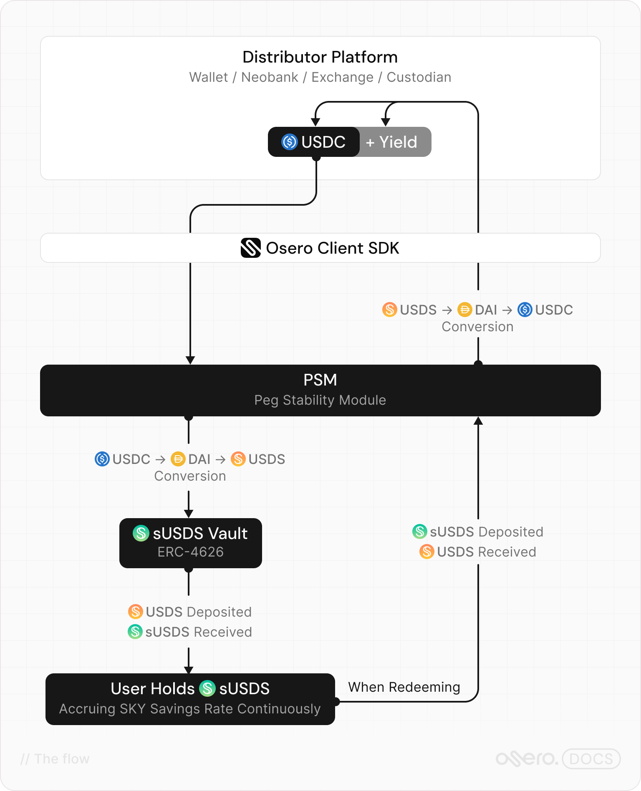

# Flow of Funds

Osero Earn connects your platform to the Sky Savings Rate through a simple flow.

Here’s how funds move from the stablecoins your users already hold into sUSDS, and what Osero handles along the way.

## The Flow

<figure><figcaption></figcaption></figure>

## Step-by-step



### User deposits a stablecoin

The user chooses the stablecoin and amount they want to put into savings. The platform uses the `@osero/client` SDK to start the deposit flow.



### Osero prepares the route

The SDK determines the required route and prepares the transactions needed to move the user’s funds into sUSDS.

The exact flow depends on the stablecoin and network. Osero handles the underlying conversions, routing, and contract interactions, so the platform doesn’t need to build this logic itself.



### User approves the transactions

The required transactions are sent to the user’s wallet for approval and executed in the correct order. Depending on the route, more than one wallet action may be required.



### User receives sUSDS

Once the transactions are complete, the user receives sUSDS, the yield-bearing savings token issued by Sky.

sUSDS earns the Sky Savings Rate automatically, so no additional action is required to start earning.



### User withdraws

When the user wants to withdraw, Osero handles the process in reverse. The user’s sUSDS is converted back into their chosen stablecoin, including the value of the yield earned over time.



## What Osero Handles Behind the Scenes

| Complexity                             | Handled by Osero Earn |
| -------------------------------------- | --------------------- |
| Chain-specific contract routing        | ✔️                    |
| PSM fee reads (tin / tout)             | ✔️                    |
| ERC-20 approval management             | ✔️                    |
| ERC-4626 vault deposit/redeem logic    | ✔️                    |
| Multi-step execution sequencing        | ✔️                    |
| Preview / quote before execution       | ✔️                    |
| Balance reads across tokens and chains | ✔️                    |
| Typed error handling                   | ✔️                    |
