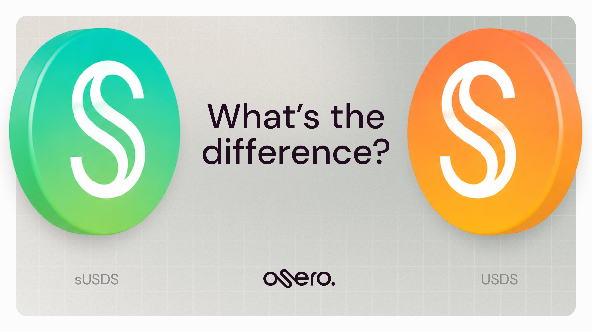

# What are sUSDS and USDS

## USDS and sUSDS

<figure><figcaption></figcaption></figure>

USDS is Sky Protocol’s stablecoin and the asset at the foundation of the Sky Savings Rate.

sUSDS is its yield-bearing savings token. As the Sky Savings Rate accrues, each sUSDS token represents more USDS over time.

This means you may receive fewer sUSDS tokens than the number of stablecoins you deposit. That’s because each sUSDS can be worth more than one USDS, not because value has been lost.

The Sky Savings Rate is set through Sky governance and can change over time. Osero does not set or control the rate.

For more details, see the [official USDS documentation](https://developers.skyeco.com/protocol/tokens/usds/).

## How the savings value accrues

Osero routes supported stablecoin deposits into sUSDS on Ethereum.

Once held as sUSDS, the savings value increases over time through the Sky Savings Rate.

<figure><figcaption></figcaption></figure>



#### USDS enters the savings system

Osero routes the deposited stablecoin into USDS, which then enters Sky’s savings system and is represented by sUSDS.



#### The Sky Savings Rate accrues

sUSDS earns the Sky Savings Rate automatically. The rate is set through Sky governance and can change over time.



#### Each sUSDS represents more USDS

As the rate accrues, each sUSDS token can represent more USDS over time, while the number of sUSDS tokens you hold stays the same.



## Rate and routing

The Sky Savings Rate is set through Sky governance and can change over time. Osero displays the current rate but does not set or control it.

Depending on the stablecoin and network you use, Osero may use Enso, LI.FI, or other supported infrastructure to complete the route.

You can review the route and required wallet actions before signing.

For a fuller explanation, see the [Sky Savings Rate](/broken/pages/LciHatZ2LfJIVcvNGdVb) page.

## Risks to consider

sUSDS carries risks related to USDS and Sky Protocol, including stablecoin, smart contract, market, and liquidity risks. Using Osero may also involve wallet, network, cross-chain, and execution risks.

For more information, see the [Official Sky sUSDS Documentation](https://developers.skyeco.com/protocol/tokens/susds/) and the Osero [risk overview](/broken/pages/1JiUgA1naUbp4rAACOaK).
