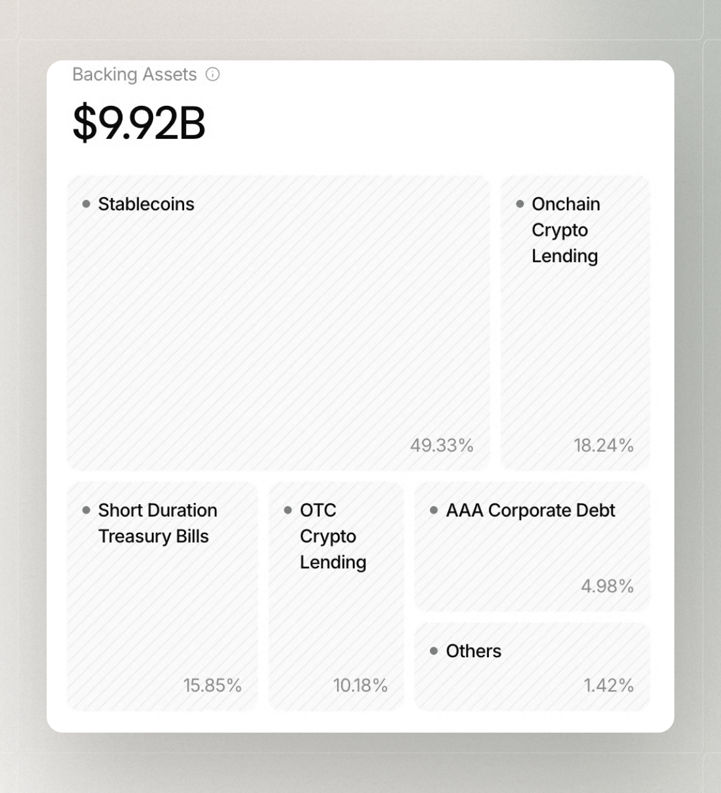

# Backing Tranparency

The **Backing** panel in the Osero App shows the main asset categories backing USDS and sUSDS. It provides a current view of the backing composition, which may change over time.

<figure><figcaption></figcaption></figure>


Amounts, allocations, and categories can change over time as positions are added, removed, mature, or are rebalanced.


## How to read the Backing panel

The panel groups the backing into broad categories, giving you a clear view of its overall composition. As the underlying portfolio changes, the assets within each category and the breakdown shown in Osero may also change.

## What the categories include

* **Stablecoins** — stablecoin positions included in the reported backing composition.
* **Onchain Crypto Lending** — lending positions executed through blockchain-based protocols.
* **Short-Duration Treasury Bills** — short-maturity government debt instruments included in the composition.
* **OTC Crypto Lending** — lending arrangements negotiated outside a public onchain lending market, which can involve crypto-backed credit and specific terms.
* **AAA Corporate Debt** — debt issued by companies with a high credit rating.
* **Other Positions** — remaining approved backing exposures that do not fit the main categories.

These categories provide a high-level view of the backing composition rather than a complete description of each underlying asset. Values and market conditions can change over time, so the panel should be treated as a transparency view of the current backing.


Risks related to the underlying assets, issuers, markets, settlement, and liquidity still apply.


## Related transparency views

Backing is one part of the information available in the Osero App. For related context, see [Liquidity](/broken/pages/Awg9mnnVutoFh6ZZoRjx) and [Capital Protection](/broken/pages/jDIvR1IA7rHVLJVODS9n).
