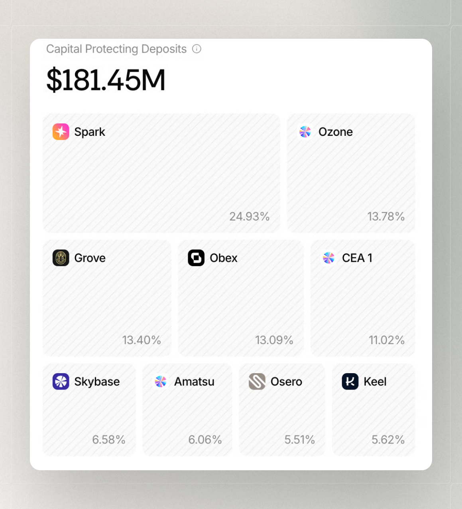

# Capital Protection

The **Protection** panel in the Osero App shows the capital buffers designed to help protect the system against losses. It breaks them down by entity, so you can see the different layers of protection and the capital available in each.

<figure><figcaption></figcaption></figure>


Capital amounts, entities, and allocations shown in the Osero App can change over time as the protection structure is updated.


## A layered approach to risk mitigation

Agents hold **Junior Risk Capital,** intended to act as the first-loss absorption layer in the capital stack in relevant loss scenarios.

Sky maintains **Senior Risk Capital** as an additional capital buffer and loss-absorption layer. It is separate from the Junior Risk Capital held by Agents and provides a second layer of loss absorption within the broader risk-mitigation framework.

If a position managed by an Agent suffers a loss, it is absorbed in the following order:

<figure><figcaption></figcaption></figure>

Under this structure, relevant losses are absorbed first by the Agent’s **Junior Risk Capital** and then by Sky’s **Senior Risk Capital**, before they could reach depositors. The exact outcome depends on the specific exposure, terms, entities, contracts, and market conditions.

The model follows a tiered capital structure, in which different layers have distinct roles in absorbing losses. The **Protection** panel shows these capital layers by entity, giving you visibility into the protection structure currently in place.

## What the order means for a user

The order of the layers shows how losses are intended to be absorbed:

1. Relevant losses are assessed against the applicable exposure and terms.
2. Junior Risk Capital is intended to absorb relevant losses first.
3. Senior Risk Capital provides an additional layer of loss absorption.
4. Remaining outcomes depend on the underlying assets, entities, contracts, markets, and conditions at the time.

The panel describes a risk-mitigation design, not a separate guarantee for a user's deposit. The outcome of any loss event depends on the specific exposure, entities, contracts, and market conditions at the time.


These layers are designed to reduce the impact of potential losses, but they do not guarantee that losses cannot occur or that a particular result will be protected.


## Related transparency views

Read the Protection panel alongside [Backing](/broken/pages/5JSePco5QbMSDzExw1jx) and [Liquidity](/broken/pages/Awg9mnnVutoFh6ZZoRjx).
