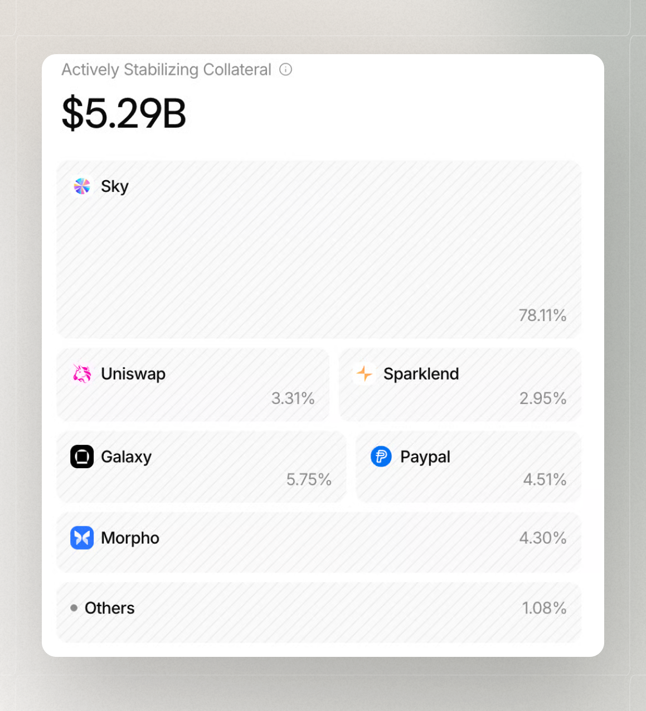

# Position Liquidity

The **Liquidity** panel in the Osero App shows **Actively Stabilising Collateral**: assets available to support redemptions and help maintain stability when market conditions change.

It complements the **Backing** and **Capital Protection** panels by providing another view of the underlying system's strength.

<figure><figcaption></figcaption></figure>


Liquidity data is dynamic. The amount, composition, and entities shown can change as positions are deployed, returned, or rebalanced.


## What Actively Stabilising Collateral means

Actively Stabilising Collateral is the part of the collateral base available to support liquidity needs and help maintain stable market conditions. Osero shows it separately so you can distinguish between overall backing and assets that can actively support liquidity.

This can include idle stablecoin balances and liquid onchain positions. Idle stablecoins are funds that are not currently deployed, while liquid onchain positions can be converted or unwound when needed.

## Available Liquidity can vary

The assets shown in this panel may not always be available at the same speed or price. This depends on the asset, market conditions, available routes, and network activity.

The amount and composition of available liquidity can change over time, so check the current view in Osero App for the latest information.

## Redemptions and peg pressure

Redemptions happen when users withdraw from a savings position or exchange an asset through an available route. Peg pressure can occur when an asset moves away from its intended value or when demand for redemptions increases.

Actively Stabilising Collateral provides liquidity that can help support redemptions and maintain stability during these periods.


Liquidity helps support the system, but execution times, prices, and available routes can vary depending on current conditions. Fees, quotes, and wallet requests are specific to each transaction.


## Related transparency views

For related context, see [Backing](/broken/pages/5JSePco5QbMSDzExw1jx) and [Capital Protection](/broken/pages/jDIvR1IA7rHVLJVODS9n).
